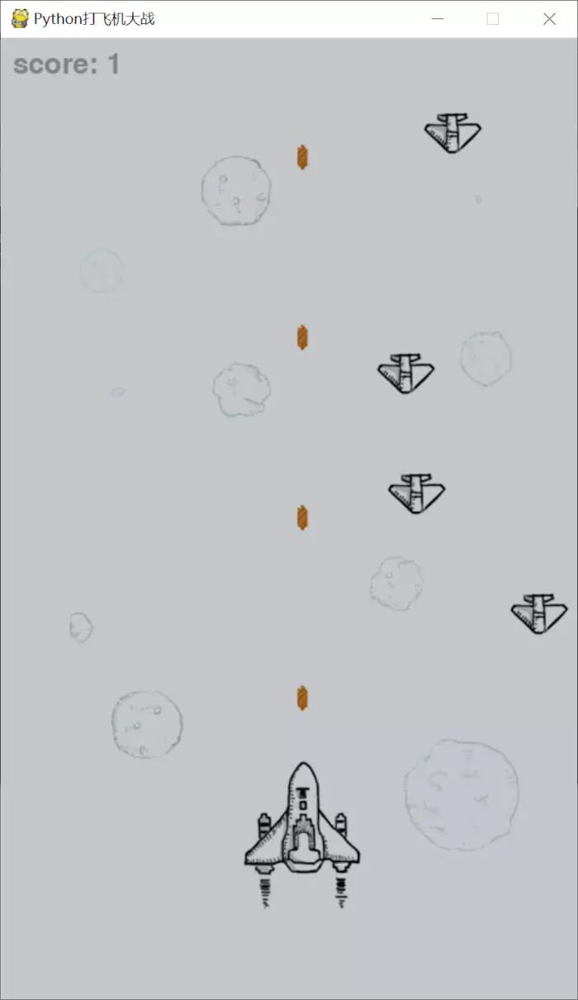

### 代码
首先设置游戏界面的大小、标题、背景图片、飞机图片（正常、爆炸）、子弹图片；然后设置两个list，分别存储敌机和被击毁的飞机；然后初始化分数、射击频率、敌机移动频率，并设置游戏循环帧率；然后进入游戏的主循环部分；然后在gameover后显示最终得分；最后处理游戏退出。     
在游戏的主循环部分主要包括以下部分：    （
1. 按一定频率发射子弹；
2. 按一定频率生成敌机；
3. 移动子弹；
4. 移动敌机；
5. 敌机与玩家飞机相撞处理方法；
6. 敌机被子弹击中处理方法；
7. 一系列绘制、显示的方法，包括：绘制背景、绘制玩家飞机、显示子弹、显示敌机、绘制得分、更新屏幕；
8. 获取、处理键盘事件；
9. 处理退出游戏。      
>
一共个建立了3个类，分别是：（1）子弹类；（2）玩家飞机类；（3）敌机类

> 相关注释见[飞机大战代码和注释](../code/Task6/plain_main.py)
### 遇到的问题
+ python图片路径的设置，即绝对路径和相对路径格式
+ 对pygame包中相关函数不清楚
+ 类和对象的使用比较模糊
### 实验截图

